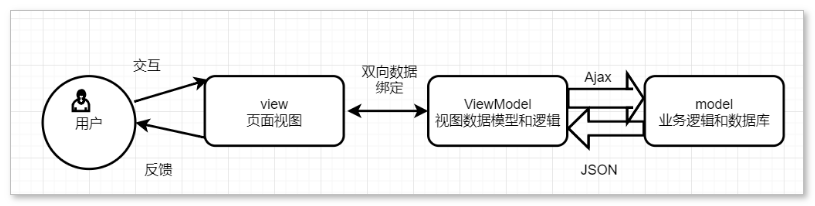

# 前端面试题

## HTTP/HTML/浏览器

### 一、说一下 http 和 https

https 的 SSL 加密是在传输层实现的。

1. **http 和 https 的基本概念**

**http**: 超文本传输协议，是互联网上应用最为广泛的一种网络协议，是一个客户端和服务器端请求和应答的标准(TCP)，用于从 WWW 服务器传输超文本到本地浏览器的传输协议，它可以使浏览器更加高效，使网络传输减少。

**https**: 是以安全为目标的 HTTP 通道，简单讲是 HTTP 的安全版，即 HTTP 下加入 SSL 层，HTTPS 的安全基础是 SSL，因此加密的详细内容就需要 SSL。
https 协议的主要作用是:建立一个信息安全通道，来确保数组的传输，确保网站的真实性。

2. **http 和 https 的区别?**

http 传输的数据都是未加密的，也就是明文的，网景公司设置了 SSL 协议来对 http 协议 传输的数据进行加密处理，简单来说 https 协议是由 http 和 ssl 协议构建的可进行加密传输和身份认证的网络协议，比 http 协议的安全性更高。

主要的区别如下:

- Https 协议需要 ca 证书，费用较高；
- http 是超文本传输协议，信息是明文传输，https 则是具有安全性的 ssl 加密传输协议。 使用不同的链接方式，端口也不同，一般而言，http 协议的端口为 80，https 的端口为 443；
- http 的连接很简单，是无状态的;HTTPS 协议是由 SSL+HTTP 协议构建的可进行加密传 输、身份认证的网络协议，比 http 协议安全。

3. **https 协议的工作原理**：

客户端在使用 HTTPS 方式与 Web 服务器通信时有以下几个步骤：

- 客户使用 https url 访问服务器，则要求 web 服务器建立 ssl 链接。
- web 服务器接收到客户端的请求之后，会将网站的证书(证书中包含了公钥)，返回或 者说传输给客户端。
- 客户端和 web 服务器端开始协商 SSL 链接的安全等级，也就是加密等级。 客户端浏览器通过双方协商一致的安全等级，建立会话密钥，然后通过网站的公钥来加 密会话密钥，并传送给网站。
- web 服务器通过自己的私钥解密出会话密钥。
- web 服务器通过会话密钥加密与客户端之间的通信。

4. **https 协议的优点**：

- 使用 HTTPS 协议可认证用户和服务器，确保数据发送到正确的客户机和服务器;
- HTTPS 协议是由 SSL+HTTP 协议构建的可进行加密传输、身份认证的网络协议，要比 http 协议安全，可防止数据在传输过程中不被窃取、改变，确保数据的完整性;
- HTTPS 是现行架构下最安全的解决方案，虽然不是绝对安全，但它大幅增加了中间人攻 击的成本;
- 谷歌曾在 2014 年 8 月份调整搜索引擎算法，并称“比起同等 HTTP 网站，采用 HTTPS 加密的网站在搜索结果中的排名将会更高”;

5. **https 协议的缺点**：

- https 握手阶段比较费时，会使页面加载时间延长 50%，增加 10%~20%的耗电；
- https 缓存不如 http 高效，会增加数据开销；
- SSL 证书也需要钱，功能越强大的证书费用越高；
- SSL 证书需要绑定 IP，不能再同一个 ip 上绑定多个域名，ipv4 资源支持不了这种消耗；

6. **http 请求报文构成**：

- 请求行：包括请求方法、URL、协议/版本；
- 请求头(Request Header)；
- 请求正文；

7. **http 响应报文构成**：
- 状态行；
- 响应头；
- 响应正文；

8. **常见请求方法**：
- 一共有8大请求类型，GET、 POST、 HEAD、OPTIONS、 PUT、 DELETE、 TRACE、 CONNECT；
- GET：请求指定的页面信息，并返回实体主体；
- POST：向指定资源提交数据进行处理请求（例如提交表单或者上传文件）、数据被包含在请求体中，POST 请求可能会导致新的资源的建立或已有资源的修改；
- PUT：从客户端向服务器传送的数据取代指定的文档的内容；
- DELETE：请求服务器删除指定的页面；
- OPTIONS：用于查询服务器针对特定资源所支持的 HTTP 请求方式，即询问客户端可以以那些方式来请求相应的资源，同时使用 OPTIONS 方式也可以用来测试服务器的性能；

9. **常见响应状态码**：
- `200` 客户端请求成功；
- `301` 资源（网页等）被永久转移到其它URL；
- `302` 临时跳转；
- `400` Bad Request - 客户端请求有语法错误，不能被服务器所理解；
- `401` Unauthorized - 请求未经授权，这个状态代码必须和 WWW-Authenticate 报头域一起使用；
- `403` Forbidden 是 HTTP 协议中的一个状态码(Status Code)，可以简单的理解为没有权限访问此站；
- `404` 请求资源不存在，可能是输入了错误的 URL；
- `500` 服务器内部发生了不可预期的错误；
- `503` Server Unavailable - 服务器当前不能处理客户端的请求，一段时间后可能恢复正常；

10. **常见的 content-type**
- application/x-www-form-urlencoded
- multipart/form-data
- application/json

## 对 MVVM 的理解

1. **基本概念**
- MVVM 分为 Model、View、ViewMode；
- Model：代表数据模型，数据和业务逻辑都在 Model 层中定义；
- View：代表 UI 视图，负责数据的展示；
- ViewModel：负责监听Model中数据的改变并且控制视图的更新，处理用户交互操作；

2. **在 vue 和 MVVM 的关系**
- Vue 框架就是一个典型的 MVVM 模型的框架；
- Vue 框架就是充当了 MVVM 开发模式中的 ViewModel 层，负责 View 和 Model 之间通信的桥梁；
- Vue 这样的 MVVM 框架将视图层和模型层有效地分离开来，只需要关心数据即可；

3. **拓展了解**
- MVVM 是一种开发模式；
- 除了 MVVM 还有 MVP、MVC 常见的开发模式；
- java 后台开发现在主要 MVC，安卓用 MVC 和 MVP 比较多；

## 项目优化方式有哪些？

1. **代码层面**

- 不带透明度的图片，可以考虑用 jpg，jpg 压缩率高于 png；
- 可以使用 tinypng 在线网站压缩图片，压缩率可以 50% 以上；
- 可以使用路由懒加载；
- 可以使用 css sprites
- 项目中引入 cdn
- 图片懒加载

2. **项目配置方面**

- 关闭 productionSourceMap
- 配置 js 的 gzip 压缩，生成 *.js.gz 文件，需要 nginx 也同步开启 gzip 支持；
- 代码压缩，主要就是去空格，减少 js 体积；
- 小图片压缩成 base64 格式；
- 去除 console.log 与警告，线上的项目不应该看到日志；

3. **服务器配置**

- nginx 开启 gzip，这样请求数据将进行 gzip 压缩；
- nginx 开启缓存；

## H5 中的新特性

- 拖拽释放 API ondrop，拖放是一种常见的特性，即抓去对象后放到另外一个位置，在 H5 中，拖放是标准的一部分，任何元素都能够拖放；
- 自定义属性 `data-id`；
- 语义化更好的内容标签：`header、nav、footer、aside、articl、section`；
- 音频、视频标签增加 `autoplay` 属性解决不自动播放问题
- 画布 `canvas`；
- 地理（Geolocation） API；
- 本地离线存储 `localStorage` 长期存储数据，浏览器关闭后数据不丢失；
- `sessionStorage` 的数据在浏览器关闭后自动删除，夸标签无法使用；
- 表单控件 `calendar , date , time , email , url , search , tel , file , number`
- 新的技术 `webworker, websocket , Geolocation`；

## CSS3 中的新特性

- 颜色: 新增 RGBA , HSLA 模式；
- 文字阴影(text-shadow)；
- 边框: 圆角(border-radius) 边框阴影 : box-shadow；
- 盒子模型: box-sizing；
- 背景: background-size background-origin background-clip；
- 渐变: linear-gradient , radial-gradient；
- 过渡 : transition 可实现动画；
- 自定义动画 animate @keyfrom；
- 媒体查询 多栏布局 @media screen and (width:800px) {...}；
- border-image；
- flex 布局；
- 2D 转换: transform: translate(x,y) rotate(x,y) skew(x,y) scale(x,y)；
- 3D 转换

## 对 web 标准化的理解

**标准分为三部分：结构、表现、行为**

- 结构：指我们平时在 body 里面写的标签，主要是由 HTML 标签组成；
- 表现：指更加丰富 HTML 标签样式，主要由 CSS 样式组成；
- 行为：指页面和用户的交互，主要由 JS 部分组成；

**W3C**

- W3C 对 web 标准提出了规范化的要求，即代码规范
  + 对结构的要求
  + 标签字母要小写
  + 标签要闭合
  + 标签不允许随意嵌套

- 对表现和行为的要求
  + 建议使用外链 CSS 和 js 脚本，实现结构与表现分离、结构与行为分离，能提高页面的渲染效率，更快地显示网页内容
